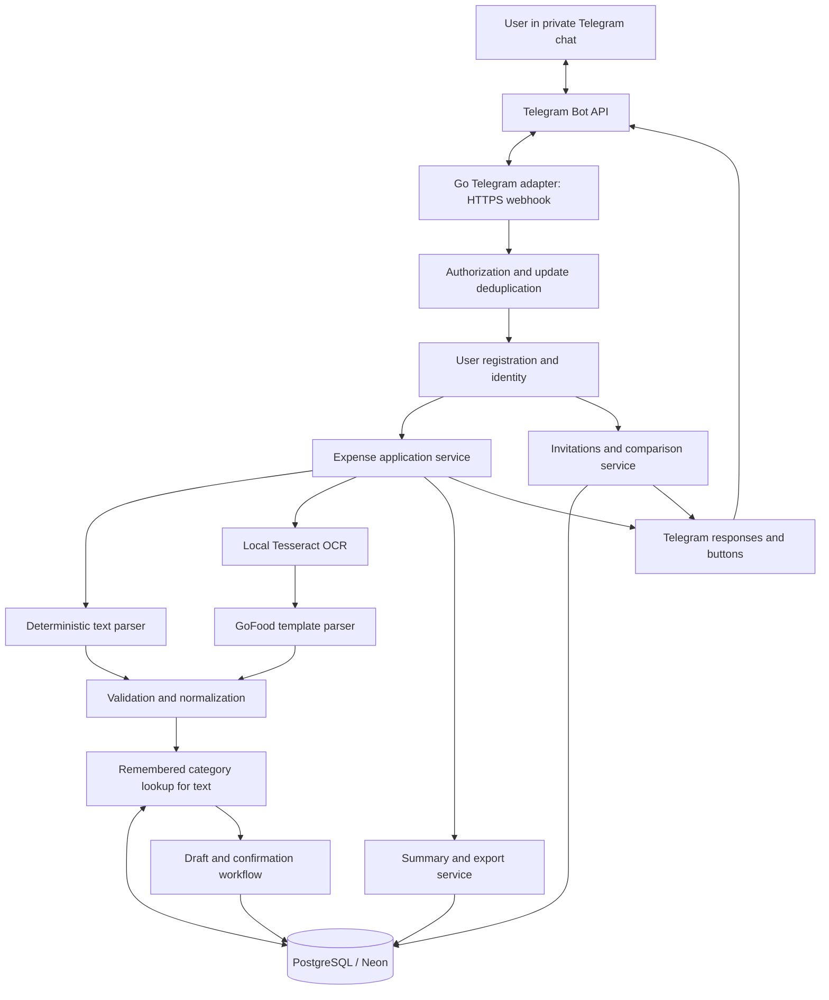

# Telegram Expense Tracker — High-Level Design

Status: Design for review; multi-user onboarding and comparison added, implementation pending  
Date: 2026-09-14

## 1. Purpose

Build a personal expense tracker in Go, using a private Telegram chat as the interface. The user can describe an expense in a message or send a receipt/payment screenshot. The bot extracts a proposed expense, asks for confirmation, and stores the confirmed record for reporting.

The first release should be useful without AI: text entry, confirmation, correction, deletion, and daily/monthly totals. Screenshot extraction extends the same workflow.

## 2. Scope and assumptions

Initial assumptions, configurable before implementation:

- Multiple registered Telegram users, private chats only. Each user owns separate expenses, categories, mappings, and interactions.
- Each user may have at most one active comparison partner. Onboarding and pairing are part of phase 1; screenshot OCR remains phase 2.
- Default currency: IDR. Default timezone: Asia/Jakarta.
- One expense per message or image. Multiple transactions require separate submissions in the first release.
- Every expense requires explicit confirmation before it affects totals.
- One Go process on Render and one PostgreSQL database hosted on Neon. Local development uses PostgreSQL in Docker.
- Text parsing uses the final amount token; phase 2 screenshots use local OCR and deterministic template mapping, starting with GoFood. No external AI API is required.

Included: text and image input, user onboarding, draft review, corrections, confirmation, deletion, daily/monthly summaries, one-to-one partner comparisons, and later CSV export.

Excluded initially: bank integrations, automatic transaction imports, budgeting, recurring expenses, split bills, group comparisons, multi-currency conversion, dashboards, and receipt line-item accounting.

## 3. User experience

### Bot voice and emoji style

Use friendly, casual messages with one or two relevant emojis per message. Keep amounts, dates, category names, and actions easy to scan. Emojis complement text labels; never use an emoji alone for an important action or error. Avoid judging spending or treating missing records as proof of savings.

| Situation | Example message |
| --- | --- |
| First start | 👋 Hey! What should I call you? |
| Category selection | 🏷️ What category is “bensin”? |
| New category | ✨ What’s your new category called? |
| Saved expense | ✅ Saved! Today’s spending: Rp125,000 |
| Reading screenshot (phase 2) | 🧾 Reading your receipt… |
| Unknown amount | 🤔 I couldn’t find the amount. Try `Tahu Telor 20k` |
| Invite created | 🤝 Spending is more fun with a partner. Share this invite! |
| Partner joins | ⚔️ You’re battling {name} now! |
| Notify inviter | 🦹 {name} is your partner in crime now! |
| Daily report | 📊 Here’s your spending today |
| No expenses | 🍃 No expenses recorded today. |
| Disconnect | 👋 You’re no longer connected with {name}. |

Example category button labels:

- 🍜 Food & drinks
- 🚗 Transport
- 🛒 Groceries
- 🛍️ Shopping
- 🧾 Bills
- 🎮 Entertainment
- 💊 Health
- 📦 Other
- ✨ New category

Use 🏷️ as the default display icon for custom categories. Keep emoji decoration separate from stored category names and IDs so it does not affect category matching or reports. User-provided names and descriptions must be escaped for the chosen Telegram formatting mode.

Example expense preview:

```text
🧾 bensin
Rp100,000 · 🚗 Transport · Today

[✅ Save] [✏️ Edit] [❌ Cancel]
```

Example comparison invitation acceptance:

```text
🤝 Connect with {name}?
You’ll share spending totals and expense counts
from the connection date onward.

[🤝 Connect] [❌ Cancel]
```

Examples elsewhere in this document describe behavior; apply this voice and emoji style when implementing the final user-facing messages. The comparison period remains the proposed scope described below.

### Registration and identity

On the first private-chat `/start`, the bot asks **“Who are you? What should I call you?”**. The reply becomes the user's display name. Telegram already supplies the numeric user ID and optional username; never ask the user to type an ID for authentication.

Persist an internal user ID, unique Telegram user ID (`BIGINT`), private chat ID, optional Telegram username, chosen display name, registration status, currency, timezone, and creation/update timestamps. The numeric Telegram sender ID establishes identity. Usernames can change or be absent; display names need not be unique. Refresh Telegram metadata from authenticated updates without overwriting the chosen display name.

Validate display names as nonempty single-line text up to 40 Unicode characters, trim/collapse whitespace, reject control characters, and escape names in messages. Store the pending onboarding interaction so the next text is interpreted as a name, not an expense. Repeated `/start` must not duplicate users or reset existing data. Seed the eight starter categories once per user when registration completes. Existing users receive help on ordinary `/start`.

An invite arriving before registration is retained as a pending invite reference with the user's onboarding state; complete name entry, then resume invite acceptance. Revalidate invitation expiry and eligibility at that point. `/cancel` clears pending invite acceptance and does not establish a relationship.

### One-to-one comparison invitations

When an unpaired registered user A sends `/compare`, create an invitation and return a Telegram deep link:

```text
https://t.me/<bot_username>?start=compare_<32-lowercase-hex-characters>
```

Interpret “hex32” as **32 hexadecimal characters generated from 16 cryptographically random bytes** (128 bits of randomness), using Go `crypto/rand` and `encoding/hex`. The full start payload is 40 characters, within Telegram's 64-character limit. It is an opaque invitation token, never a Telegram user ID or the permanent relationship ID. Check random generation errors and enforce uniqueness.

The user forwards the link themselves. Opening it and completing Telegram's Start action delivers `/start compare_<token>` to the bot. A cannot connect a person who has not interacted with the bot; the recipient initiates that interaction by following the link.

Proposed first-release invite behavior:

- One pending invitation per inviter, single-use, expiring after 24 hours. A fresh unpaired `/compare` rotates any pending invitation; tell the inviter that older links no longer work. Provide a Cancel invite button.
- Store a SHA-256 digest for lookup, creator, expiry, state, consumed-by ID, and consumed timestamp. Do not log raw tokens. The raw link is shown at creation; regeneration rotates it, so no reversible token storage is needed. Short-lived incoming Telegram payloads may contain it and must follow payload-retention rules.
- Show A that the invitation enables sharing comparison totals with its recipient. On B's side, show A's display name and the same sharing scope with **Connect / Cancel** before linking; this prevents merely inspecting a link from joining unexpectedly.
- Link possession grants the ability to accept the invitation. No second approval from A is needed because A created it for sharing. The first eligible recipient to confirm consumes it.
- Reject malformed, unknown, expired, revoked, or consumed tokens, self-invites, and pairing when either person already has a partner. Never silently replace an existing partner.
- When A is already paired, `/compare` displays the comparison report instead of generating a new invitation.

After a successful connection:

```text
To B: ⚔️ You’re battling {A display name} now!
To A: 🦹 {B display name} is your partner in crime now!
```

Offer `/disconnect` with confirmation to either partner. Disconnect ends comparison access for both immediately, invalidates obsolete relationship actions, and keeps each person's own expenses intact. Both may create a new invitation afterward. Invalidate outstanding invites from both participants when a pair is formed.

### Comparison report (proposed initial scope)

Start with **total spending and expense counts**, today and this month, for each partner. Both use IDR and Asia/Jakarta initially. Include a numeric difference; the playful battle wording does not imply lower spending is always better. Mark an empty period as “No recorded expenses” so absence of logging is not presented as proven savings.

For the initial design, compare expenses dated on or after the connection's local calendar date, intersected with the selected daily/monthly period. Display “Comparing since <date>”; this includes that connection date's entries but not earlier history. This reporting/sharing scope is a proposed default to confirm before implementation. Connection messages themselves reveal names only.

Partners see only aggregate totals and counts through the dedicated compare operation. Descriptions, individual transactions, screenshots, category breakdowns, drafts, and category-learning mappings remain private. Custom category names differ between users, so category-by-category competition is deferred. Own `/today`, `/month`, and `/recent` commands always return only the caller's records.

### Scale and data isolation

One Go application and one PostgreSQL database can serve multiple users; do not create a database or bot per person. Resolve the authenticated Telegram sender to an internal user ID and pass it explicitly to every expense/category/report operation. Scope every query and callback mutation by owner. Pairing authorizes a narrow aggregate read, never access to a partner's editing endpoints.

Index expenses by `(owner_id, expense_date)` and enforce owner-consistent foreign keys. Apply bounded per-user input/invite limits and shared worker limits so one person cannot exhaust all processing capacity; choose numeric limits during implementation. A small group does not require microservices. Free-tier capacity remains a measured constraint: track latency, database compute/storage, and phase 2 OCR CPU/memory before admitting a larger audience.

### Text entry

Example, first occurrence:

```text
User: bensin 100k
Bot: What category is “bensin”?
     [Transport] [Food & drinks] [Groceries] [More…] [+ New category]
User: [Transport]
Bot: Bensin · Rp100,000 · Transport · Today
     I'll remember Transport for “bensin” when you save.
     [Save] [Edit] [Cancel]
```

After saving, a later `bensin 25k` automatically produces a draft for Rp25,000 in Transport. The amount does not affect category matching. The bot still shows Save, Edit, and Cancel; automatic categorization does not automatically save an expense.

Text entry ends with an amount; the description can contain any number of words, including numbers. The amount is not tied to the second word or the first numeric token.

#### Amount parsing rule

1. Trim leading/trailing whitespace.
2. Split at the last whitespace boundary: the final token is the amount candidate, and everything before it is the description.
3. Validate the entire final token against `^[0-9]+[kK]?$`: digits with an optional `k`/`K` suffix for thousands. Starting with a digit alone is not sufficient (`100cats` is invalid).
4. Convert using checked integer arithmetic, including the suffix multiplier and currency minor-unit scale. Require a positive amount within `int64` range and a nonempty description.
5. Preserve all preceding words and numbers in the description. Normalize that description separately for remembered category lookup.

Do not search backward for another number when the final token is invalid. Ask the user to put the amount at the end, for example `Tahu Telor 20k`. Reject decimal/thousands punctuation in this initial grammar rather than guessing; richer amount formats and natural-language dates can follow later.

| Input | Description | Amount / outcome |
| --- | --- | --- |
| `bensin 100k` | `bensin` | Rp100,000 |
| `Tahu Telor 20k` | `Tahu Telor` | Rp20,000 |
| `Nice 8 Ball Cafe 100k` | `Nice 8 Ball Cafe` | Rp100,000 |
| `Nice 8 Ball Cafe 25000` | `Nice 8 Ball Cafe` | Rp25,000 |
| `Tahu Telor 20K` | `Tahu Telor` | Rp20,000 |
| `  Tahu Telor   20k  ` | `Tahu Telor` (outer whitespace trimmed) | Rp20,000 |
| `Cafe 8 100k` | `Cafe 8` | Rp100,000 |
| `Tahu Telor 20k yesterday` | — | Ask for amount at the end; do not extract `20k` |
| `Nice 8 Ball Cafe` | — | Ask for amount; do not extract `8` |
| `Tahu Telor 100cats` | — | Invalid amount suffix |
| `20k` | — | Ask for a description |
| `Tahu Telor 0` | — | Amount must be positive |

A description ending in a number without a separate amount (for example `Cafe 8`) is inherently ambiguous under this syntax: it parses as description `Cafe`, amount Rp8. The mandatory preview makes that interpretation visible before saving; the bot cannot infer the omitted amount.

Category learning uses the complete parsed description: `Nice 8 Ball Cafe 100k` and `Nice 8 Ball Cafe 25k` both resolve to the key `nice 8 ball cafe`.

The bot displays the draft with Save, Edit, and Cancel buttons. Edit asks the user to choose a field and submit its replacement. Missing or ambiguous amounts and an unassigned category must be supplied before Save becomes available.

### Custom categories (phase 1)

Seed starter categories, but let the user add their own. Every category picker, including saved-expense edits, provides a `+ New category` button; paginate existing categories when necessary.

Example: `gym 150k` → category picker → `+ New category` → bot asks for the name → user replies `Fitness` → category is created and selected on the expense draft → normal Save/Edit/Cancel preview. After Save, `gym 200k` automatically uses Fitness. Daily/monthly reports include Fitness when it has confirmed expenses.

- Treat the reply to a category-name prompt as a name, not a new expense. Persist the interaction type and originating draft so the flow survives a restart. `/cancel` returns to the picker without creating a category.
- Trim and collapse whitespace; accept a nonempty single-line display name up to 40 Unicode characters. Keep a lowercase normalized name for uniqueness per owner. Reject control characters and escape names when rendering Telegram messages.
- If the normalized name already exists, select the existing category instead of creating a duplicate (`Fitness` and `fitness` are the same category).
- Creating a category saves it immediately and returns to the draft. Cancelling the expense afterward leaves the new category available but does not save an expense or learn a description mapping.
- Category creation does not change a remembered mapping until the expense/revision is confirmed under the existing learning rules.
- Starter and custom categories behave identically in selection, remembered mappings, and reports. Empty categories are omitted from expense breakdowns.
- Category rename, merge, and deletion are outside phase 1; expense deletion remains supported.

### Remembered categories

The bot learns an explicit mapping from a text description to the user's chosen category. No AI is needed for this feature.

- Parse out the amount first, then normalize the remaining description by trimming whitespace, collapsing repeated spaces, and lowercasing. Preserve the original description for display.
- Match the whole normalized description, scoped to the owner. `BENSIN 100k` and `bensin 25k` use the same key, `bensin`. `bensin motor 25k` is a different key and asks for a category initially. Do not infer synonyms or use substring matching in phase 1.
- If there is no mapping, present category buttons. Save the chosen mapping only when the expense is confirmed; cancelled or expired drafts teach nothing.
- If a mapping exists, prefill its category and allow correction in the preview.
- When changing a previously remembered category, offer “This expense only” or “Remember for bensin”. Apply the selected scope only on Save. A one-off correction leaves the existing mapping intact.
- Changing a mapping affects future drafts. Existing expenses retain their stored categories, so historical reports do not change. Existing pending drafts retain their visible category until explicitly edited.
- If the description is edited, run category lookup again and require a choice for an unknown description. Discard any staged learning decision for the previous description.

### Screenshot entry

Phase 2 starts with GoFood order/payment screenshots from supported layouts. The user sends a photo or supported image document. The bot downloads it, runs local OCR, maps recognized text through a GoFood template parser, and presents the same editable draft UI. Unknown layouts fall back to manual entry.

Illustrative OCR text supplied by the user: `McDonalds Thursday 17 September Purchase Details Price 2000`. For a verified template where this Price field represents the final paid total, map merchant/description to `McDonalds`, amount to Rp2,000, and service to `gofood`. The date is separate from the description. This example is a design fixture, not a verified current GoFood layout.

Extraction should distinguish the final amount paid from subtotals, discounts, account balances, and fees. If the image contains multiple transactions or the total is unclear, ask the user for the intended amount; do not silently choose a transaction. An optional caption can provide context, but conflicts with the image must be surfaced.

GoFood drafts default to the editable category Food & drinks. Store GoFood as the service and the restaurant as the merchant, so reports can distinguish spending by category from spending through GoFood. OCR output does not automatically train text category mappings.

### Commands

| Command | Behavior |
| --- | --- |
| `/start` | Register a new user, show help to a returning user, or resume an invitation payload |
| `/help` | Show accepted input formats and available commands |
| `/compare` | Create/rotate an invite when unpaired; show totals/counts when paired |
| `/disconnect` | Confirm ending the current comparison relationship |
| `/today` | Show today's confirmed expenses, total, and category breakdown |
| `/month` | Show this month's total and category breakdown |
| `/recent` | Show recent expenses with record-specific edit/delete actions |
| `/cancel` | Cancel the current field-edit interaction |
| `/export` | Later: export confirmed expenses as CSV |

Deletion requires a confirmation button. Editing a saved expense produces a proposed revision; reports change only when that revision is confirmed.

## 4. Architecture



Use a modular monolith: one executable, no separate queue service, cache, frontend, or microservices. Telegram transport code should not contain expense business rules. Parsers return the same candidate structure so text and image inputs share validation and persistence.

### Main components

- **Telegram adapter:** receives updates, maps messages/callbacks to application actions, and sends replies. Proposed library: `github.com/go-telegram/bot`.
- **Access control:** verifies webhook origin, derives user identity from the Telegram sender ID, and enforces private-chat and owner-scoped access. Registration is permitted for unknown senders; expense operations require completed onboarding.
- **User service:** idempotent registration, display-name entry, per-user settings, and starter category creation.
- **Comparison service:** invitation generation/redemption, one-to-one relationships, disconnect, authorized aggregate reports, and durable notification events.
- **Expense service:** manages draft creation, field edits, confirmation, revisions, and deletion.
- **Text parser:** validates the final whitespace-delimited token as the amount and preserves the full preceding description, including embedded numbers. Uses checked integer conversion and never scans earlier numeric tokens as a fallback.
- **Category catalog:** seeds starter categories, creates owner-scoped custom categories, prevents duplicate names, and supplies paginated pickers.
- **Category resolver:** normalizes text descriptions, looks up remembered mappings, and requests a category for unknown descriptions. Stages mapping changes for confirmation.
- **OCR adapter:** runs local Tesseract and returns recognized words, lines, positions, and confidence.
- **Template parser:** recognizes supported GoFood layouts and maps merchant, paid total, and date to candidate fields with unresolved-field indicators.
- **Validator:** enforces positive amounts, supported currency, valid dates, and category IDs belonging to the authorized owner. OCR and template output must pass the same domain validation as text input.
- **Repository:** PostgreSQL queries, transactions, migrations, and deduplication constraints.
- **Reporting service:** reads confirmed records and computes exact integer totals.

Suggested Go layout: `cmd/bot`, `internal/telegram`, `internal/user`, `internal/compare`, `internal/expense`, `internal/parser`, `internal/ocr`, `internal/receipt`, `internal/config`, `internal/httpserver`, `internal/category`, `internal/postgres`, `internal/report`, and `migrations`.

## 5. Data model

| Entity | Main fields | Purpose |
| --- | --- | --- |
| User | Internal ID, unique Telegram user ID, chat ID, optional username, display name, status, timezone, currency, timestamps | Identity and registration |
| Comparison invitation | ID, unique token digest, creator ID, expires at, status, consumed-by ID/time | Single-use pairing invitation |
| Comparison pair | ID, started at, ended at | Relationship lifecycle and comparison period |
| Active pair member | User ID (primary key), pair ID, slot (1 or 2) | At most one active pair per user; unique pair/slot |
| Notification outbox | Event ID, recipient user ID, pair ID, type, status, retry metadata | Durable post-commit connection/disconnection notifications |
| Draft | ID, owner ID, source chat/message IDs, source type, optional target expense ID/version, amount in minor units, currency, description, merchant, service, category ID, expense date, unresolved fields, template ID/version, normalized description key, category source, staged mapping action/version, status, created/updated timestamps | Pending new expense or revision |
| Expense | ID, owner ID, originating draft ID, amount in minor units, currency, description, merchant, service, category ID, expense date, version, created/updated timestamps, deleted timestamp | Confirmed financial record |
| Category | ID, owner ID, display name, normalized name, created timestamp | Starter and custom categories; unique owner/normalized name |
| Category mapping | Owner ID, normalized description, category ID, version, created/updated timestamps | Unique owner/description mapping learned from confirmed user choices |
| Inbound update | Telegram update ID, payload needed for processing, state, attempts, next attempt time, last error | Durable intake and retry tracking |
| Interaction | Owner/chat ID, draft ID, interaction type (onboarding, invite acceptance, field edit, or category creation), pending invite ID, selected edit field, expiration | Resume onboarding, invite acceptance, field editing, or category-name entry after a restart |

Owner IDs reference the internal User primary key. Pending interactions may have no draft during onboarding or invite acceptance. Comparison pairs persist after disconnection; active memberships are removed atomically. Invitation acceptance must create exactly two distinct members with different slots in one transaction.

Use integer minor units (`int64` in Go) with explicit currency rules; never floating-point arithmetic for money. Under the initial IDR whole-rupiah input policy, Rp35,000 is stored as 3,500,000 minor units. Formatting and parsing must share a tested currency scale.

Store the expense date as a local calendar date. Store operational timestamps in UTC. Reports group by expense date in the configured timezone, not message receipt time. Default an absent date to today and make the default visible in the preview.

Seed starter categories: Food & drinks, Transport, Groceries, Shopping, Bills, Entertainment, Health, and Other. Users can add categories from any category picker. Drafts, expenses, and remembered mappings reference category IDs with owner-consistent foreign keys; enforce normalized-name uniqueness in the database so retries or concurrent creation cannot produce duplicates. Text categories come from remembered user choices or explicit category selection. GoFood defaults to Food & drinks; screenshot categories are editable and do not train text mappings in the initial release. Reports group by the category ID stored on each confirmed expense and display its catalog name, including custom categories.

Do not retain raw image bytes or full OCR output by default. Remove raw inbound payloads after processing and a short configurable retention period; keep minimal update IDs/status for deduplication.

## 6. Processing and correctness

### Intake and extraction

1. Receive a Telegram webhook, verify its secret header and request size, and authorize its sender/private chat.
2. Persist authorized inbound work under a unique Telegram update ID before returning a successful webhook response. Return a retryable error if persistence fails; repeated delivery must not duplicate expenses. Local polling may be added for a separate development bot, acknowledging only after durable intake.
3. Process durable pending work. Text parsing is immediate; image extraction runs through a bounded worker to keep commands responsive.
4. For text, look up the normalized description in category mappings. Persist the draft and ask for a category if no match exists; otherwise send its preview. Screenshot drafts use the separately validated extraction suggestion or request a category when missing.
5. If extraction fails, show a retry/manual-entry option. Never create a confirmed expense from a failed or incomplete extraction.

Use bounded retries with backoff for transient Telegram failures and retryable OCR worker failures. Invalid images and unsupported layouts should end with an actionable response. Pending work is recovered on restart. A failed preview send can be retried; duplicate preview messages are acceptable, duplicate expense records are not.

### Draft lifecycle

`pending → confirmed | cancelled | expired`

Field edits keep the draft pending. Drafts expire after a configurable interval, initially 24 hours. Callbacks reference persisted draft IDs and always recheck ownership and current state. Several drafts may exist at once; only one free-text interaction (onboarding, field editing, or category creation) per user is active, with explicit prompts identifying the draft.

### Atomic pairing and notifications

Redeem an invite in one transaction: lock both user rows in stable ID order, lock/recheck the invitation, validate its status/expiry and both users' registration and absence of active membership, create the pair and its two memberships, consume the invite, revoke their other invites, and insert notification outbox events. A primary key on active membership's user ID prevents a person joining two pairs even through concurrent invitations. Use consistent lock order for pairing, rotation, and disconnect; retry serialization/deadlock failures within a bound.

Repeated acceptance by the same successful recipient returns the existing relationship result; acceptance by a different user fails. The permanent pair ID is separate from the invitation token. Disconnect locks/rechecks the relationship and removes both active memberships in a transaction. Comparison queries recheck active membership in the query/snapshot; new requests after disconnect cannot fetch the former partner's totals. Already delivered Telegram messages cannot be recalled by this access change.

Send the two requested connection notifications only after commit using a durable outbox. Deduplicate enqueueing by event/recipient; retry transient failures and handle blocked bots as undeliverable without rolling back the connection. Telegram sends can still duplicate after an ambiguous network timeout, so promise exactly-once pairing, not exactly-once messaging. Before sending a delayed connection event, recheck that the pair is still active so obsolete notifications are not delivered after disconnection.

### Confirmation and duplicate protection

Confirm inside a single database transaction: verify the pending draft, create/update the expense, apply any staged category mapping change, and mark the draft confirmed. Mapping writes and expense writes must succeed or roll back together. Enforce a unique originating draft ID for new expenses. Repeated Save callbacks return the existing result. Saved-expense revisions use a version check to prevent stale edits overwriting newer changes.

For staged mapping changes, use the mapping version observed by the draft (or expected absence for a new mapping). If another draft has changed it, do not silently overwrite the newer choice: refresh the review and let the user choose this expense only or explicitly update the mapping. Automatically categorized drafts do not rewrite mappings when saved.

Deduplicate update delivery and draft creation using unique update IDs and source message identity. Resending the same screenshot as a new Telegram message is a separate case: later, a heuristic can warn about similar amount/date/merchant records. Do not automatically discard legitimate repeated purchases.

## 7. Local OCR and GoFood template mapping

### Pipeline and runtime

`Screenshot → local OCR → layout recognition → field mapping → validation → draft → user confirmation`

Proposed engine: Tesseract, installed alongside the Go application with the needed English and Indonesian language data. Invoke its CLI from Go using `exec.CommandContext` with fixed arguments and a timeout; no shell interpolation. This keeps Go application code simple while packaging the OCR executable as a local runtime dependency. OCR is built into the deployed service, though the OCR engine itself is not written in Go. No separate OCR server or paid image API is needed.

Use structured OCR output (TSV or equivalent) rather than flattening everything into one string. Preserve word/line positions to associate labels with nearby values even when a receipt has multiple columns. Define boundaries such as `Recognize(ctx, image) -> OCRDocument` and `Parse(OCRDocument) -> CandidateExpense` so mapping logic can be tested without running OCR.

### Template rules

Start with one actual GoFood layout, then add explicit variants as fixtures become available. Each versioned template defines recognition anchors, expected field regions/label relationships, supported language and currency formats, and required fields. Use anchors and relative positions rather than relying solely on absolute pixels or word indexes.

- **Merchant/description:** restaurant title in the recognized header region, separated from date and purchase-detail labels. Preserve multiword names and embedded numbers.
- **Amount:** value associated with the template's verified final paid-total label. A generic Price label is only sufficient if sample receipts establish that it means the transaction total. Never choose the first, last, or largest number globally: those could be dates, item prices, fees, subtotals, or balances.
- **Currency:** use IDR for the supported GoFood template. Parse its verified grouping/decimal conventions separately from the stricter text-entry grammar, then convert with checked integer arithmetic.
- **Date:** extract a complete valid transaction date when present. If the year/date is missing or ambiguous, mark it unresolved and show today's date as an explicit editable default. Do not silently invent a year from a partial date.
- **Service/category:** set service `gofood` and propose Food & drinks, allowing category correction before saving. Merchant stays separate from service.

OCR misreads, missing anchors, multiple candidate totals, or unfamiliar layouts produce an incomplete draft or manual-entry prompt. Confidence can help flag a field for review but does not prove correctness. Never silently substitute digits to force a valid amount. Template updates affect future extraction, not previously saved expenses.

### Boundaries and verification

Limit file types, encoded file size, decoded dimensions, processing duration, and worker concurrency. Remove temporary images on completion/error and clean abandoned temporary files on startup. Retain Telegram file references in pending work so interrupted extraction can attempt a fresh download; if unavailable, ask for resubmission. Do not execute instructions found in OCR text.

Before implementing a template, inspect representative GoFood screenshots supplied for development and create anonymized fixtures. Cover different restaurant names, dates, resolutions, supported language variants, discounts, delivery fees, and competing prices. First test OCR-document-to-field mapping, then test actual screenshots through the complete OCR pipeline. Unsupported variants should fail visibly rather than return a plausible incorrect total.

## 8. Deployment and operations

Development: run the Go executable with PostgreSQL in Docker Compose. Use a separate development Telegram bot; local polling or a development HTTPS tunnel can be added when intake is implemented. The initial skeleton exposes health endpoints only.

Personal deployment: Render web service with Neon PostgreSQL and an HTTPS Telegram webhook. Render Free can sleep after inactivity and loses local file changes on restart/redeploy; keep all durable state in PostgreSQL. Incoming webhook requests can wake the app, but the first response can be delayed. Check provider quotas at setup; do not use an expiring free Render database for permanent history. Phase 2 OCR resource use must be measured before choosing the hosting tier.

Configuration: Telegram bot token, database URL, HTTP port, webhook secret, default currency, timezone, and, in phase 2, OCR paths/limits. Read secrets from environment; never commit or log them. Replace the skeleton's required TELEGRAM_ALLOWED_USER_ID with database-backed user identity before enabling registration; the current code still has the single-owner configuration and does not implement onboarding or pairing. Require verified TLS for remote PostgreSQL connections.

Use a small PostgreSQL connection pool and bounded query/connection timeouts. Liveness health checks must not query the database repeatedly; expose a separate on-demand readiness endpoint. Avoid continuous aggressive background polling that keeps Neon compute awake. Durable job processing must recover after sleep/restart.

Apply versioned SQL migrations with locking before new code serves traffic. Migration failures must stop the release; changes must remain compatible with the preceding app version during rollout. Keep write transactions short and never hold one open during network calls.

GitHub Actions runs formatting, vet, tests, and builds on pull requests and pushes to main, with an isolated PostgreSQL service for integration tests. Once hosting is configured, deploy the tested main revision after passing checks, serialize deploy requests, and verify release completion. Keep deploy-hook credentials in GitHub secrets and disable competing Render auto-deploy triggers. The skeleton has CI only; automatic deployment is not yet enabled.

Back up PostgreSQL through consistent logical backups or managed snapshots with appropriate retention, stored independently of Render's ephemeral filesystem. Verify a restore before relying on the tracker for real records. Handle shutdown by stopping intake and leaving unfinished durable work recoverable. Code rollback does not reverse schema migrations.

Log operation IDs, processing latency, and sanitized errors. Avoid logging message bodies, receipts, credentials, and raw OCR output. Restrict access to the database and backups. OCR runs on the bot host; receipt images are not forwarded to an additional AI/OCR provider. Telegram remains the message transport.

## 9. Delivery phases and acceptance criteria

### Phase 1 — Basic tracker and reports

- Go application, bot setup, multi-user onboarding and isolation, PostgreSQL migrations.
- One-to-one comparison invites, atomic connection/disconnection, aggregate reports, and notifications.
- Parse a final amount token after a multiword description, preserving embedded numbers; show a persistent editable draft.
- Ask for unknown descriptions, learn categories on Save, and reuse them across different amounts.
- Create custom categories from the picker, select existing categories on duplicate names, and include custom categories in reports.
- Support one-off category corrections and explicit updates to remembered mappings.
- Save/cancel, recent records, confirmed revisions, confirmed deletion.
- Daily expense list and total, daily/monthly category breakdowns, monthly total, and recent-expense history. All reports use confirmed, non-deleted records and reflect confirmed edits/deletions.
- Durable intake and safe repeated callbacks.
- Render/Neon deployment, GitHub Actions checks and deployment wiring, and verified backup/restore.

Acceptance: a text expense can be reviewed, saved exactly once, corrected, reported, and deleted. Users cannot access another user's private records; paired users can access only the defined aggregates. A restart preserves drafts and confirmed records. Check the amount parsing examples above, integer overflow, whitespace/case handling, date boundaries, confirmation idempotency, and transactional rollback with focused tests. Verify that `Tahu Telor 20k` and `Nice 8 Ball Cafe 100k` retain their complete descriptions and extract only the final amount. Verify that saving `bensin 100k` as Transport prefills Transport for `bensin 25k`, including case/whitespace variants and after restart. Verify unknown descriptions still prompt, cancelled drafts do not teach, one-off overrides preserve the mapping, stale mapping updates do not overwrite newer choices, and mapping changes leave historical reports unchanged.

Custom-category acceptance: creating Fitness while entering `gym 150k` selects it on the draft; saving teaches `gym → Fitness`; `gym 200k` reuses it after restart. Confirmed expenses appear under Fitness in reports. Case/whitespace-equivalent names and repeated creation requests reuse one category. Cancelling name entry creates nothing; cancelling the expense after category creation retains the category but creates no expense or mapping.

Multi-user acceptance: register two independent users, preserve pending onboarding invites across restart, learn different categories for the same description, and verify private reports remain isolated. Redeem one random invite successfully, deliver the specified messages, and reject self/expired/reused/conflicting invitations. Concurrent acceptance must create only one pair. Verify comparison date boundaries, no-record messaging, notification recovery, and access revocation after disconnect.

### Phase 2 — GoFood screenshots with local OCR

- Package Tesseract and language data with the service.
- Local OCR adapter and versioned GoFood template parser based on actual sample screenshots.
- Extract merchant, final paid total, and date; record service GoFood and propose Food & drinks.
- Temporary image handling and extraction validation.
- Missing/ambiguous-field correction and graceful retry/manual fallback.
- Bounded asynchronous extraction with restart recovery.

Acceptance: supported GoFood screenshots produce reviewable drafts with the correct restaurant and final paid amount using local OCR only. The illustrative McDonalds/2000 fixture maps correctly under its explicit template assumptions. Verify real anonymized fixtures including discounts, fees, competing prices, OCR errors, and unsupported layouts. Unclear totals require correction; OCR failures never change reported totals. Screenshot expenses appear in the existing phase 1 reports after confirmation.

### Phase 3 — Convenience and operation

- CSV export, richer text/date parsing, duplicate-submission warnings.
- Evaluate always-on paid hosting if free-tier wake-up delays become inconvenient.
- Optional budgets and reminders only after the core workflow is reliable.

## 10. Decisions to revisit

- Confirm IDR and Asia/Jakarta defaults for all initial users.
- Confirm the proposed comparison scope: totals/counts only, from the connection date onward; invitation expiry initially 24 hours.
- Before phase 2, collect representative GoFood screenshots and verify the initial layout, total labels, languages, and currency/date formats.
- Verify Render/Neon quotas and regions at setup; benchmark OCR before selecting phase 2 compute.
- Decide whether screenshot retention is ever needed; initial design retains no originals.

These decisions do not block the text-only implementation.

## References

- Telegram Bot API: https://core.telegram.org/bots/api
- Telegram bots FAQ: https://core.telegram.org/bots/faq
- Proposed Go Telegram library: https://github.com/go-telegram/bot
- Tesseract documentation: https://tesseract-ocr.github.io/tessdoc/
- Tesseract structured output: https://tesseract-ocr.github.io/tessdoc/Command-Line-Usage.html

- Render free-service limits: https://render.com/docs/free
- Neon pricing: https://neon.com/pricing

- Telegram deep links and start payloads: https://core.telegram.org/bots/features#deep-linking
